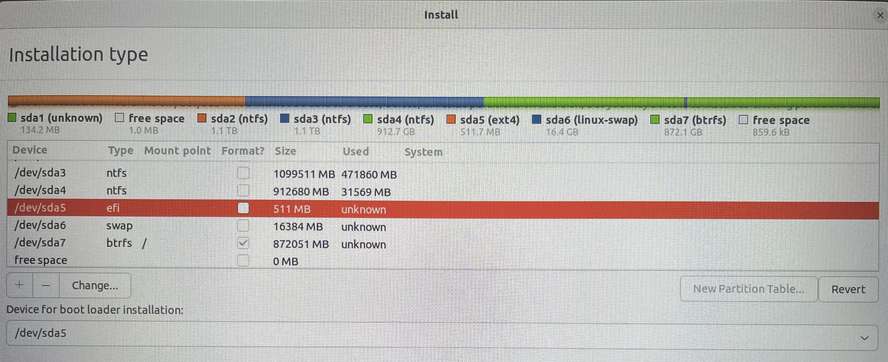
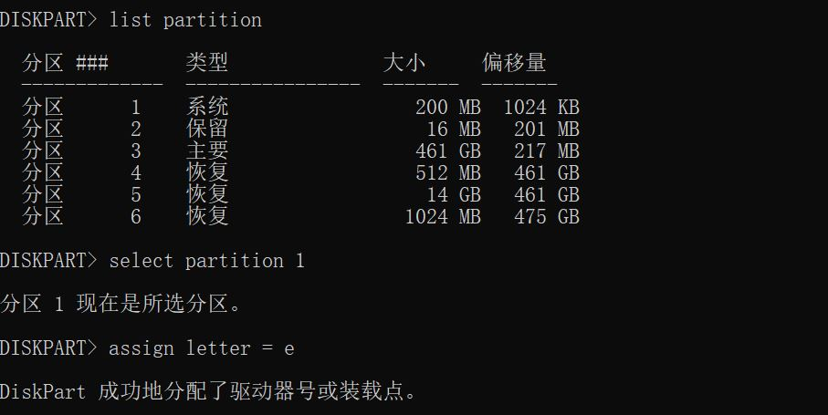
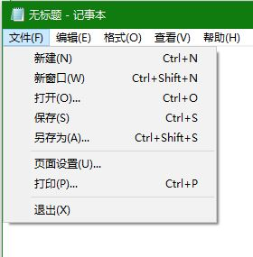

# Linux 1_Ubuntu 22.04系统

## 1. Ubuntu 22.04 系统安装

ubuntu 22.04 镜像地址：[清华大学开源软件镜像站 | Tsinghua Open Source Mirror](https://mirrors.tuna.tsinghua.edu.cn/)

使用烧录工具将系统烧录进USB设备。

（Win 10）按住`shift`键重启，选择疑难解答 - 高级选项 - UEFI 固件设置即可进入 BIOS 界面。

1. 关闭 `security boot`。
2. 调整USB启动顺序，选择含系统引导程序的 USB 作为开机首选项。

3. 进入安装界面。
4. 进行分区

> 1. efi 系统分区：512MB，ext4系统类型。
> 2. swap 交换分区：一般为30G，Linux-swap类型。
> 3. btrf 分区：根目录（Logical 类型）

选择启动分区为`efi`对应硬盘分区。



随后按照系统指引安装即可。

## 2. Ubuntu 22.04 系统卸载

在Windows的磁盘管理器中将除了`efi`分区的所有分区格式化。

对于`efi`分区，其不能通过普通的手法进行格式化，按照以下方法进行格式化。

> 1. 为 win10 的 efi 分区分配盘符；
>
> 在管理员权限的 cmd 命令行中输入 `diskpart`；
>
> 随即输入以下指令：
>
> ```shell
> # 检索系统的物理盘
> list disk
> 
> # 选择C盘所在的硬盘
> select disk 0
> 
> # 列出分区
> list partition
> 
> # 选择C盘所在分区
> select partition 1
> 
> # 为 win10 的 EFI 系统分区分配盘符，这里e为盘符(不区分大小写)，不要和已有的盘符重复，分配完成后不要关闭此窗口，进入资源管理器可看到E盘
> assign letter = e
> ```
>
> 
>
> 2. 删除 EFI 文件夹
>
> 直接打开会发现权限不够，打不开。 
>
> 需要运用一个小技巧，先用管理员权限打开记事本，然后通过记事本菜单栏里的打开来访问，可以看到 EFI 文件夹，进入**找到 ubuntu 文件夹，删除即可**。
>
> 
>
> 打开 EFI ，删除 ubuntu 文件夹。
>
> 3. 删除C盘分配的盘符
>
> ```shell
> remove letter=e
> ```

## 3. Ubuntu 22.04 换源

```shell
sudo gedit /etc/apt/sources.list
```

在`source.list`文件里面替换为国内的源（以下为清华源）：

```
# 默认注释了源码镜像以提高 apt update 速度，如有需要可自行取消注释
deb https://mirrors.tuna.tsinghua.edu.cn/ubuntu/ jammy main restricted universe multiverse
# deb-src https://mirrors.tuna.tsinghua.edu.cn/ubuntu/ jammy main restricted universe multiverse
deb https://mirrors.tuna.tsinghua.edu.cn/ubuntu/ jammy-updates main restricted universe multiverse
# deb-src https://mirrors.tuna.tsinghua.edu.cn/ubuntu/ jammy-updates main restricted universe multiverse
deb https://mirrors.tuna.tsinghua.edu.cn/ubuntu/ jammy-backports main restricted universe multiverse
# deb-src https://mirrors.tuna.tsinghua.edu.cn/ubuntu/ jammy-backports main restricted universe multiverse

deb https://mirrors.tuna.tsinghua.edu.cn/ubuntu/ jammy-security main restricted universe multiverse
# deb-src https://mirrors.tuna.tsinghua.edu.cn/ubuntu/ jammy-security main restricted universe multiverse

# deb http://security.ubuntu.com/ubuntu/ jammy-security main restricted universe multiverse
# # deb-src http://security.ubuntu.com/ubuntu/ jammy-security main restricted universe multiverse

# 预发布软件源，不建议启用
# deb https://mirrors.tuna.tsinghua.edu.cn/ubuntu/ jammy-proposed main restricted universe multiverse
# # deb-src https://mirrors.tuna.tsinghua.edu.cn/ubuntu/ jammy-proposed main restricted universe multiverse
```

完成后保存，随后进行：

```shell
sudo apt update && sudo apt upgrade
```

